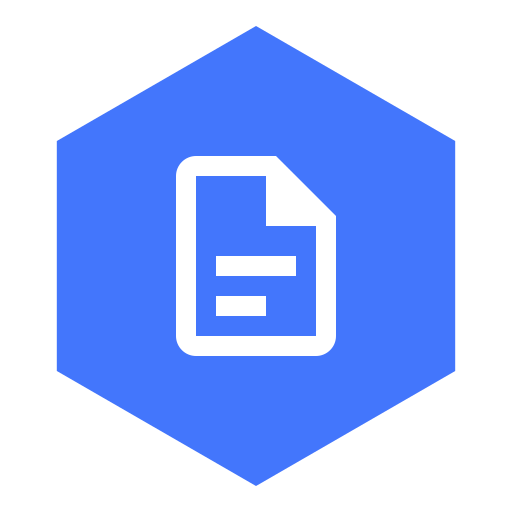
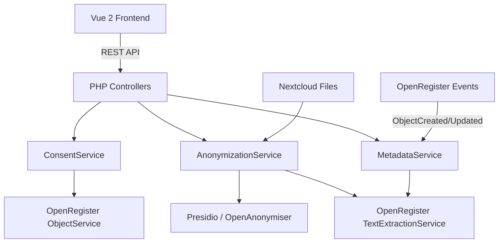

<p align="center">
  
</p>

<h1 align="center">DocuDesk</h1>

<p align="center">
  <strong>GDPR-compliant document processing for Nextcloud — local anonymization, WOO consent tracking, and automated metadata enrichment</strong>
</p>

<p align="center">
  <a href="https://github.com/ConductionNL/docudesk/releases"></a>
  <a href="https://github.com/ConductionNL/docudesk/blob/main/LICENSE"></a>
  <a href="https://github.com/ConductionNL/docudesk/actions"></a>
</p>

---

DocuDesk adds GDPR-safe document processing to Nextcloud. It anonymizes sensitive documents, tracks publication consent periods under the Dutch Wet Open Overheid (WOO), and automatically enriches document metadata — all without sending data to external cloud services.

> **Requires:** [OpenRegister](https://github.com/ConductionNL/openregister) — consent records and processing results are stored as OpenRegister objects.

## Features

### Document Anonymization
- **Local Processing Pipeline** — All text extraction, entity recognition, and anonymization runs on your own Nextcloud instance; no data leaves your premises
- **3-Step Workflow** — Upload → entity extraction → anonymize; review identified entities before committing
- **Named Entity Recognition** — Detect and anonymize names, addresses, BSN numbers, and other sensitive data via Presidio / OpenAnonymiser integration
- **Risk Level Assessment** — Automatic risk classification per document using configurable thresholds
- **Batch Processing** — Process multiple documents in a single operation
- **Anonymized Output** — Download the redacted document alongside the original

### WOO Publication Consent
- **Objection Period Tracking** — Enforce the minimum 4-week publication objection period required by the Wet Open Overheid
- **Consent Lifecycle** — Track each document through intake → objection period → consent decision → publication
- **Notification Management** — Record when citizens were notified and whether objections were raised
- **Consent Dashboard** — At-a-glance statistics on pending objection periods, decisions, and recent activity
- **Audit Trail** — Full history of every consent decision and status change

### Metadata Enrichment
- **Automatic Language Detection** — Detect document language on upload
- **Keyword Extraction** — Auto-generate searchable keywords from document content
- **Topic Classification** — Classify documents into categories automatically
- **Event-Driven** — Metadata enrichment triggers automatically when OpenRegister objects are created or updated

### Integrations
- **Nextcloud Dashboard Widgets** — `AnonymizationWidget` and `FileEntitiesWidget` for quick overviews on the Nextcloud Dashboard
- **OpenRegister Events** — Listens to `ObjectCreated`, `ObjectUpdated`, and `ObjectDeleted` events for automated enrichment
- **Admin Settings** — Configure register/schema bindings, consent period duration, and enrichment toggles

## Architecture



### Data Model

| Object | Description |
|--------|-------------|
| PublicationConsent | Document consent record with objection period, notification, and decision |
| File | Nextcloud file with extracted metadata (language, keywords, entities, risk level) |
| Entity | Detected sensitive data point (person name, address, BSN, etc.) |

### Directory Structure

```
docudesk/
├── appinfo/           # Nextcloud app manifest, routes
├── lib/               # PHP backend — controllers, services, event listeners, widgets
│   ├── Controller/    # Anonymization, Consent, Metadata, Settings, Dashboard
│   ├── Service/       # AnonymizationService, ConsentService, MetadataService, SettingsService
│   ├── EventListener/ # OpenRegister object event integration
│   └── Dashboard/     # Nextcloud Dashboard widget definitions
├── src/               # Vue 2 frontend — components, Pinia stores, views
│   ├── views/         # Dashboard, anonymization, consent, settings
│   └── store/         # Pinia stores (consent, anonymization)
├── website/           # Docusaurus documentation site
├── img/               # App icons
└── l10n/              # Translations (en, nl)
```

## Requirements

| Dependency | Version |
|-----------|---------|
| Nextcloud | 28 – 32 |
| PHP | 8.1+ |
| [OpenRegister](https://github.com/ConductionNL/openregister) | v0.2.10+ |
| Presidio / OpenAnonymiser | optional — for entity recognition |

## Installation

### From the Nextcloud App Store

1. Go to **Apps** in your Nextcloud instance
2. Search for **DocuDesk**
3. Click **Download and enable**

> OpenRegister must be installed first. [Install OpenRegister →](https://apps.nextcloud.com/apps/openregister)

### From Source

```bash
cd /var/www/html/custom_apps
git clone https://github.com/ConductionNL/docudesk.git
cd docudesk
npm install
npm run build
composer install
php occ app:enable docudesk
```

## Development

### Start the environment

```bash
docker compose -f openregister/docker-compose.yml up -d

# With AI services (Presidio, OpenAnonymiser):
docker compose -f openregister/docker-compose.yml --profile ai up -d
```

### Frontend development

```bash
cd docudesk
npm install
npm run dev        # Watch mode
npm run build      # Production build
```

### Code quality

```bash
# PHP
composer phpcs          # Check coding standards
composer cs:fix         # Auto-fix issues
composer phpmd          # Mess detection
composer phpmetrics     # HTML metrics report

# Frontend
npm run lint            # ESLint
npm run stylelint       # CSS linting
```

### Documentation

```bash
cd website
npm install
npm start    # Local preview
npm run build
```

## Tech Stack

| Layer | Technology |
|-------|-----------|
| Frontend | Vue 2.7, Pinia, @nextcloud/vue |
| Build | Webpack 5, @nextcloud/webpack-vue-config |
| Backend | PHP 8.1+, Nextcloud App Framework |
| Data | OpenRegister (PostgreSQL JSON objects) |
| PDF | mPDF 8 |
| Templates | Twig 3 |
| NLP | Presidio, OpenAnonymiser (optional) |
| Quality | PHPCS, PHPMD, phpmetrics, ESLint, Stylelint |

## Standards & Compliance

- **GDPR / AVG:** Privacy-by-design; all processing happens locally, no external cloud
- **Wet Open Overheid (WOO):** Enforces the mandatory 4-week publication objection period
- **Rijksoverheid Data Sovereignty:** 100% local processing — sensitive documents never leave your instance
- **Accessibility:** WCAG AA (Dutch government requirement)
- **Audit trail:** Full change history on all objects
- **Localization:** English and Dutch

## Related Apps

- **[OpenRegister](https://github.com/ConductionNL/openregister)** — Object storage layer (required dependency)
- **[OpenCatalogi](https://github.com/ConductionNL/opencatalogi)** — Publish anonymized documents in open catalogs
- **[Procest](https://github.com/ConductionNL/procest)** — Case management for document-related processes

## Support

For support, contact us at [support@conduction.nl](mailto:support@conduction.nl).

For a Service Level Agreement (SLA), contact [sales@conduction.nl](mailto:sales@conduction.nl).

## License

EUPL-1.2

## Authors

Built by [Conduction](https://conduction.nl) — open-source software for Dutch government and public sector organizations.
