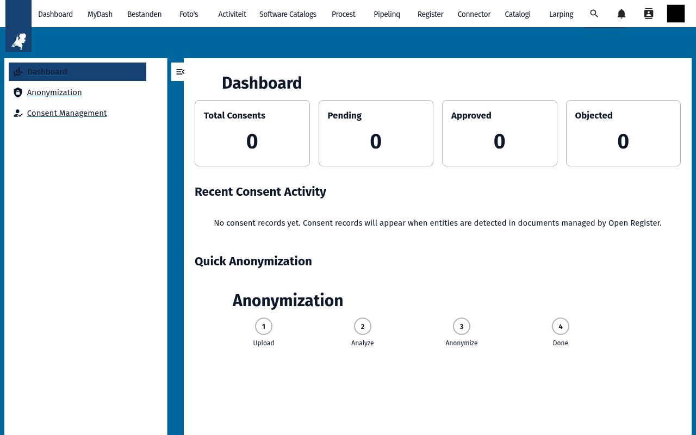
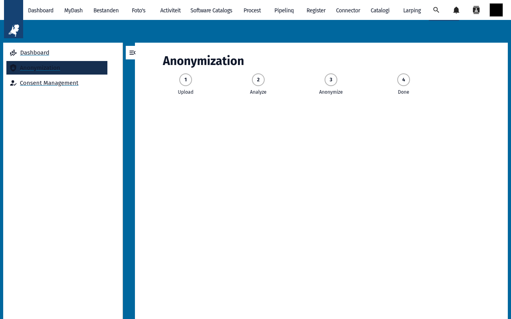
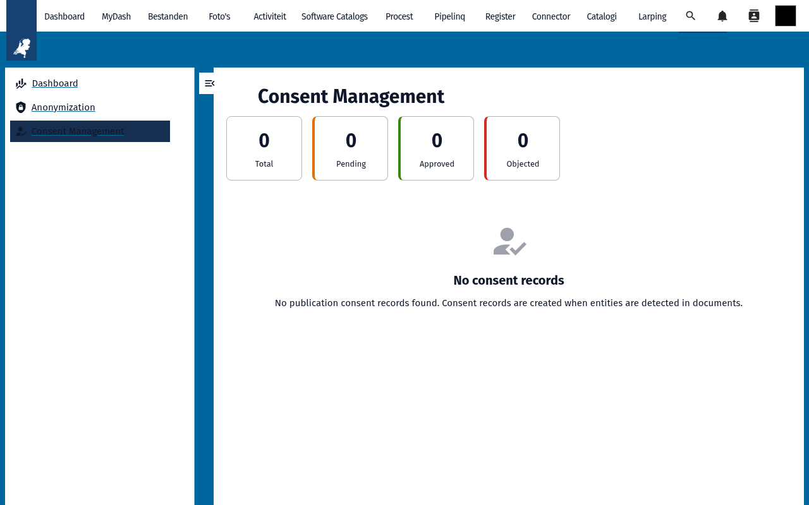
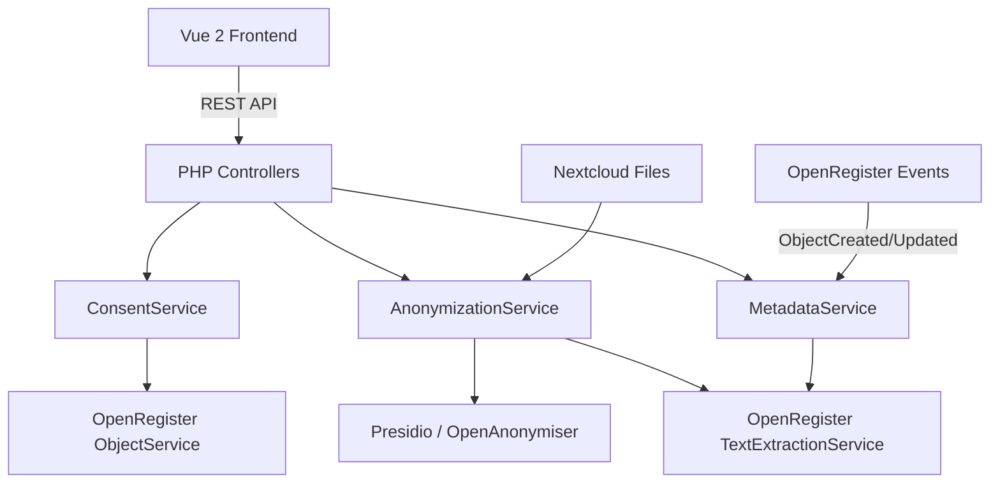

<p align="center">
  
</p>

<h1 align="center">DocuDesk</h1>

<p align="center">
  <strong>GDPR-compliant document anonymization, consent management, and metadata enrichment for Nextcloud</strong>
</p>

<p align="center">
  <a href="https://github.com/ConductionNL/docudesk/releases"></a>
  <a href="https://github.com/ConductionNL/docudesk/blob/main/LICENSE"></a>
  <a href="https://github.com/ConductionNL/docudesk/actions"></a>
  <a href="https://docudesk.app"></a>
</p>

---

DocuDesk adds GDPR-safe document processing to Nextcloud. It anonymizes sensitive documents using AI-powered PII detection, tracks publication consent periods under the Dutch Wet Open Overheid (WOO), generates PDF documents from Twig templates, and automatically enriches document metadata — all without sending data to external cloud services.

> **Requires:** [OpenRegister](https://github.com/ConductionNL/openregister) — all data is stored as OpenRegister objects (no own database tables).

## Screenshots

<table>
  <tr>
    <td></td>
    <td></td>
    <td></td>
  </tr>
  <tr>
    <td align="center"><em>Dashboard</em></td>
    <td align="center"><em>Anonymization</em></td>
    <td align="center"><em>Consent Management</em></td>
  </tr>
</table>

## Features

### Document Anonymization
- **Local Processing Pipeline** — All text extraction, entity recognition, and anonymization runs on your own instance; no data leaves your premises
- **3-Step Workflow** — Upload, review detected entities, anonymize; inspect identified PII before committing
- **Named Entity Recognition** — Detect names, addresses, BSN numbers, and other sensitive data via Presidio / OpenAnonymiser
- **Risk Level Assessment** — Automatic risk classification per document using configurable thresholds
- **Batch Processing** — Process multiple documents in a single operation

### Consent Management
- **Objection Period Tracking** — Enforce the minimum 4-week publication objection period required by the Wet Open Overheid
- **Consent Lifecycle** — Track each document through intake, objection period, consent decision, and publication
- **Consent Dashboard** — At-a-glance statistics on pending objection periods, decisions, and recent activity
- **Audit Trail** — Full history of every consent decision and status change

### Document Generation
- **PDF Generation** — Create PDF documents from structured data using mPDF
- **Twig Templates** — Define reusable document templates with Twig syntax
- **Metadata Enrichment** — Automatic language detection, keyword extraction, and topic classification on upload

### Integrations
- **OpenRegister Events** — Listens to `ObjectCreated`, `ObjectUpdated`, and `ObjectDeleted` events for automated enrichment
- **Nextcloud Dashboard Widgets** — `AnonymizationWidget` and `FileEntitiesWidget` for quick overviews
- **Admin Settings** — Configure register/schema bindings, consent period duration, and enrichment toggles

## Architecture



### Data Model

| Object | Description |
|--------|-------------|
| PublicationConsent | Consent record with objection period, notification, and decision |
| File | Nextcloud file with extracted metadata (language, keywords, entities, risk level) |
| Entity | Detected sensitive data point (person name, address, BSN, etc.) |

### Directory Structure

```
docudesk/
├── appinfo/           # Nextcloud app manifest, routes, navigation
├── lib/               # PHP backend — controllers, services, event listeners, widgets
│   ├── Controller/    # Anonymization, Consent, Metadata, Settings, Dashboard
│   ├── Service/       # AnonymizationService, ConsentService, MetadataService
│   ├── EventListener/ # OpenRegister object event integration
│   └── Dashboard/     # Nextcloud Dashboard widget definitions
├── src/               # Vue 2 frontend — components, Pinia stores, views
│   ├── views/         # Dashboard, anonymization, consent, settings
│   └── store/         # Pinia stores (consent, anonymization)
├── docs/              # Feature specs, architecture, API documentation
├── img/               # App icons and screenshots
├── l10n/              # Translations (en, nl)
└── website/           # Docusaurus documentation site (docudesk.app)
```

## Requirements

| Dependency | Version |
|-----------|---------|
| Nextcloud | 28 – 33 |
| PHP | 8.1+ |
| [OpenRegister](https://github.com/ConductionNL/openregister) | latest |
| Presidio / OpenAnonymiser | optional — for AI-powered entity recognition |

## Installation

### From the Nextcloud App Store

1. Go to **Apps** in your Nextcloud instance
2. Search for **DocuDesk**
3. Click **Download and enable**

> OpenRegister must be installed first. [Install OpenRegister](https://apps.nextcloud.com/apps/openregister)

### From Source

```bash
cd /var/www/html/custom_apps
git clone https://github.com/ConductionNL/docudesk.git
cd docudesk
npm install
npm run build
composer install
php occ app:enable docudesk
```

## Development

### Start the environment

```bash
docker compose -f openregister/docker-compose.yml up -d

# With AI services (Presidio, OpenAnonymiser):
docker compose -f openregister/docker-compose.yml --profile ai up -d
```

### Frontend development

```bash
cd docudesk
npm install
npm run dev        # Watch mode
npm run build      # Production build
```

### Code quality

```bash
# PHP
composer phpcs          # Check coding standards
composer cs:fix         # Auto-fix issues
composer phpmd          # Mess detection
composer phpmetrics     # HTML metrics report

# Frontend
npm run lint            # ESLint
npm run stylelint       # CSS linting
```

## Tech Stack

| Layer | Technology |
|-------|-----------|
| Frontend | Vue 2.7, Pinia, @nextcloud/vue |
| Build | Webpack 5, @nextcloud/webpack-vue-config |
| Backend | PHP 8.1+, Nextcloud App Framework |
| Data | OpenRegister (PostgreSQL JSON objects) |
| PDF | mPDF 8 |
| Templates | Twig 3 |
| NLP | Presidio, OpenAnonymiser (optional) |
| Quality | PHPCS, PHPMD, phpmetrics, ESLint, Stylelint |

## Documentation

Full documentation is available at **[docudesk.app](https://docudesk.app)**

| Page | Description |
|------|-------------|
| [Architecture](docs/architecture.md) | Technical architecture and design decisions |
| [Features](docs/features/) | Per-feature specification documents |
| [API](docs/api/) | REST API and integration documentation |

## Standards & Compliance

- **GDPR / AVG:** Privacy-by-design; all processing happens locally, no external cloud
- **Wet Open Overheid (WOO):** Enforces the mandatory 4-week publication objection period
- **Rijksoverheid Data Sovereignty:** 100% local processing — sensitive documents never leave your instance
- **Accessibility:** WCAG AA (Dutch government requirement)
- **Authorization:** RBAC via OpenRegister
- **Audit trail:** Full change history on all objects
- **Localization:** English and Dutch

## Related Apps

- **[OpenRegister](https://github.com/ConductionNL/openregister)** — Object storage layer (required dependency)
- **[OpenCatalogi](https://github.com/ConductionNL/opencatalogi)** — Publish anonymized documents in open catalogs
- **[Procest](https://github.com/ConductionNL/procest)** — Case management for document-related processes

## License

This project is licensed under the [EUPL-1.2](LICENSE).

### Dependency license policy

All dependencies (PHP and JavaScript) are automatically checked against an approved license allowlist during CI. The following SPDX license families are approved for use in dependencies:

- **Permissive:** MIT, ISC, BSD-2-Clause, BSD-3-Clause, 0BSD, Apache-2.0, Unlicense, CC0-1.0, CC-BY-3.0, CC-BY-4.0, Zlib, BlueOak-1.0.0, Artistic-2.0, BSL-1.0
- **Copyleft (EUPL-compatible):** LGPL-2.0/2.1/3.0, GPL-2.0/3.0, AGPL-3.0, EUPL-1.1/1.2, MPL-2.0
- **Font licenses:** OFL-1.0, OFL-1.1

Dependencies with licenses not on this list will fail CI unless explicitly approved in `.license-overrides.json` with a documented justification.

### License exceptions

| Package | Reason |
|---------|--------|
| `@nextcloud/axios` | Nextcloud official package (GPL-3.0) — required dependency for all Nextcloud apps. Our apps run within the Nextcloud (AGPL-3.0) ecosystem. Approved 2026-03-15. |

## Authors

Built by [Conduction](https://conduction.nl) — open-source software for Dutch government and public sector organizations.
