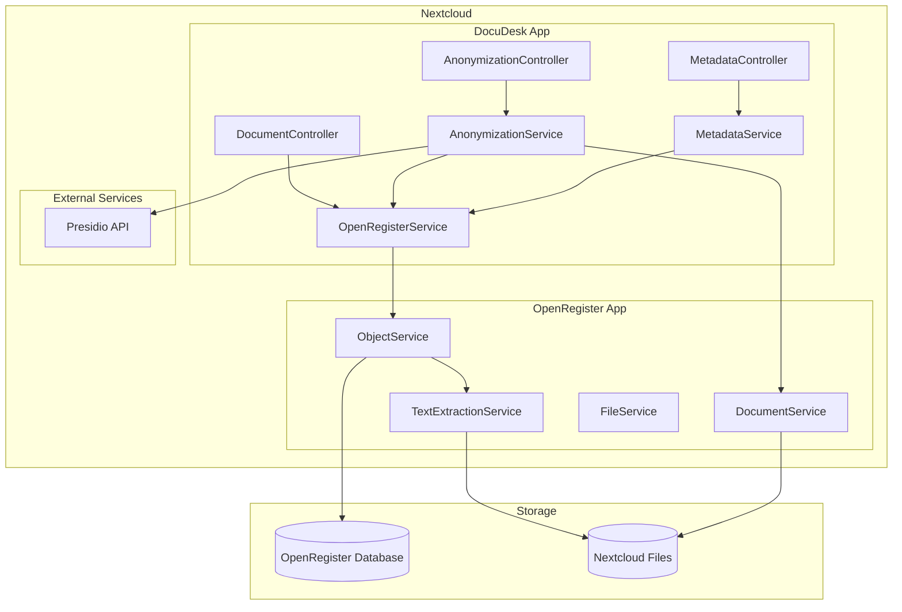
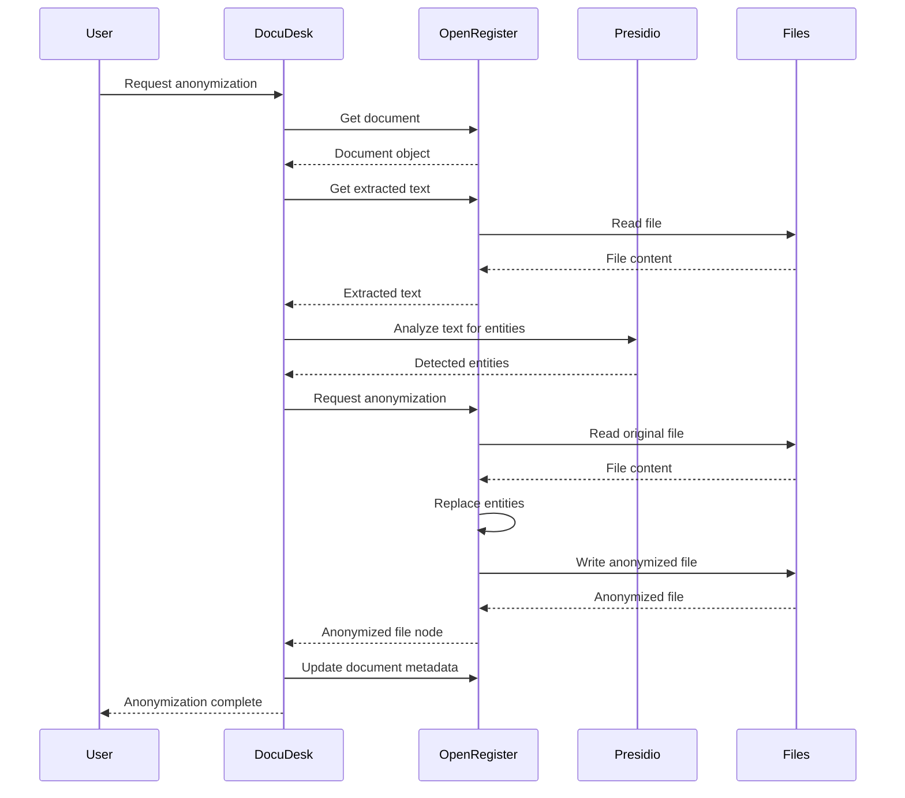
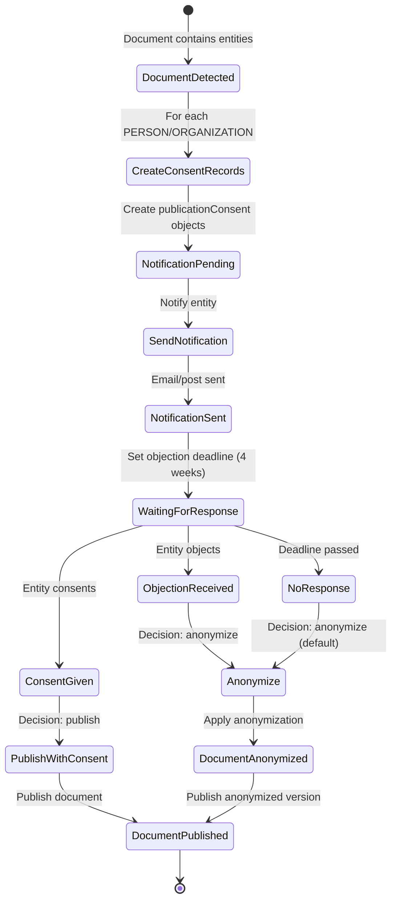

# DocuDesk Architecture

## Overview

DocuDesk is a document anonymization and metadata enhancement app for Nextcloud. It integrates with OpenRegister for document storage, text extraction, and document manipulation. DocuDesk focuses on GDPR-compliant anonymization and metadata enhancement capabilities.

## Architecture Diagram

The following diagram shows how DocuDesk integrates with OpenRegister:

## Document Flow

The following sequence diagram shows how document anonymization works:

## Component Responsibilities

### DocuDesk Components

- **AnonymizationController**: Handles HTTP requests for anonymization operations
- **MetadataController**: Handles HTTP requests for metadata operations
- **DocumentController**: Handles HTTP requests for document CRUD operations
- **AnonymizationService**: Orchestrates anonymization workflow using Presidio and OpenRegister
- **MetadataService**: Extracts and enhances document metadata
- **OpenRegisterService**: Wrapper around OpenRegister ObjectService for document operations

### OpenRegister Components

- **ObjectService**: Manages document objects in OpenRegister
- **TextExtractionService**: Extracts text from various file formats
- **DocumentService**: Provides word replacement and document manipulation capabilities
- **FileService**: Handles file operations in Nextcloud

## Data Flow

### Document Storage

All documents are stored as objects in OpenRegister. The document object contains:
- File metadata (name, path, size, mime type)
- Extracted text (handled by OpenRegister TextExtractionService)
- Anonymization results (if applicable)
- Enhanced metadata (if applicable)

### Anonymization Process

1. Document is stored in OpenRegister (via FileService)
2. OpenRegister extracts text automatically (TextExtractionService)
3. DocuDesk retrieves document and extracted text
4. DocuDesk sends text to Presidio for entity detection
5. DocuDesk uses OpenRegister DocumentService to replace detected entities
6. Anonymized file is created in Nextcloud Files
7. Document metadata is updated with anonymization results

### Metadata Enhancement Process

1. Document is stored in OpenRegister
2. DocuDesk retrieves document object
3. MetadataService extracts basic metadata from document object
4. MetadataService enhances metadata with:
   - Language detection
   - Keyword extraction
   - Topic classification
   - Date normalization
5. Enhanced metadata is stored back in document object

## Integration Points

### OpenRegister Integration

DocuDesk integrates with OpenRegister through:
- **ObjectService**: For document CRUD operations
- **TextExtractionService**: For accessing extracted text
- **DocumentService**: For word replacement and anonymization

### Presidio Integration

DocuDesk uses Presidio for entity detection:
- Analyzer endpoint: Detects PII entities in text
- Configurable confidence threshold
- Supports multiple entity types (PERSON, EMAIL_ADDRESS, PHONE_NUMBER, etc.)

## Publication Consent Workflow

For GDPR and Dutch Wet Open Overheid compliance, DocuDesk includes a publication consent management system. The following diagram shows the workflow:

### Publication Consent Entity

The `publicationConsent` schema tracks:
- **Entity Information**: Type (PERSON/ORGANIZATION), text, and contact details
- **Notification Status**: Whether the entity has been notified
- **Consent Status**: pending, consent_given, objection_received, no_response, anonymized
- **Objection Deadline**: Minimum 4 weeks according to Wet Open Overheid
- **Publication Decision**: anonymize, publish_with_consent, publish_anonymized, or reject

### Workflow Steps

1. **Entity Detection**: When a document is analyzed, entities (PERSON, ORGANIZATION) are detected
2. **Consent Record Creation**: For each detected entity, a `publicationConsent` object is created
3. **Notification**: Entities are notified via email or postal mail about pending publication
4. **Response Period**: Entities have 4 weeks (minimum) to respond
5. **Decision Making**:
   - If consent given → publish with entity information
   - If objection received → anonymize entity before publication
   - If no response → default to anonymization
6. **Publication**: Document is published based on the decision

## Configuration

DocuDesk configuration includes:
- `document_register`: OpenRegister register type for documents (default: 'document')
- `document_schema`: OpenRegister schema type for documents (default: 'document')
- `presidio_analyzer_url`: Presidio analyzer API URL
- `presidio_anonymizer_url`: Presidio anonymizer API URL
- `presidio_confidence_threshold`: Confidence threshold for entity detection (default: 0.7)
- `publication_objection_period_days`: Number of days for objection period (default: 28, minimum 4 weeks per Wet Open Overheid)

## Dependencies

- **OpenRegister**: Required for document storage and text extraction
- **Presidio**: Required for entity detection (external service)
- **Nextcloud 28-32**: Required Nextcloud version
- **PHP 8.0+**: Required PHP version

