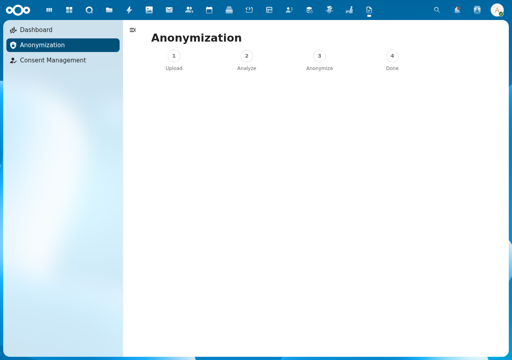

# Anonymization Pipeline

## Overview

DocuDesk provides a 4-step document anonymization pipeline for GDPR-compliant processing. Files are uploaded to a per-user DocuDesk folder, analyzed for personally identifiable information (PII), and anonymized by replacing detected entities with placeholders. All processing runs 100% locally.

## Pipeline Steps

1. **Upload**: Drag-and-drop or select a file to upload to your DocuDesk/ folder
2. **Analyze**: Extract text and detect entities (persons, organizations, locations, etc.)
3. **Anonymize**: Review detected entities and anonymize the document
4. **Done**: Download the anonymized document

## Screenshot

## API Endpoints

| Method | URL | Description |
|--------|-----|-------------|
| GET | `/api/anonymization/files` | List processed files with entity counts |
| POST | `/api/anonymization/upload` | Upload file (multipart form data) |
| POST | `/api/anonymization/extract/{fileId}` | Extract text and detect entities |
| POST | `/api/anonymization/anonymize/{fileId}` | Anonymize document |

## Technical Details

- Files stored in Nextcloud filesystem under user's `DocuDesk/` folder
- Entity detection via OpenRegister's TextExtractionService (Presidio/OpenAnonymiser)
- Anonymization via OpenRegister's FileService
- Duplicate file names handled with counter suffix (e.g., `report_1.pdf`)
