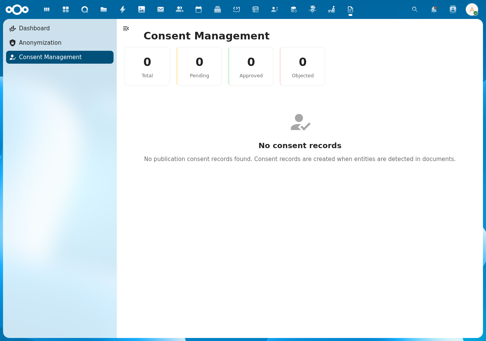

# Consent Management

## Overview

DocuDesk provides GDPR-compliant publication consent tracking for entities detected in documents. Under the Wet Open Overheid (WOO), affected entities must be notified and given an objection period (minimum 4 weeks) before document publication.

## Features

- **Stats Cards**: At-a-glance view of Total, Pending, Approved, and Objected consent records
- **Consent List**: Browse all consent records with entity text, type, and status badges
- **Consent Detail**: View and update consent status, notification status, and publication decision
- **Automatic Deadline**: Objection deadline calculated from configurable period (default 28 days)

## Screenshot

## API Endpoints

| Method | URL | Description |
|--------|-----|-------------|
| GET | `/api/consents` | List all consent records |
| POST | `/api/consents` | Create consent record |
| GET | `/api/consents/{id}` | Get specific consent |
| PUT | `/api/consents/{id}` | Update consent status |
| GET | `/api/consents/document/{documentId}` | Get consents for document |

## Status Lifecycle

| Field | Values |
|-------|--------|
| consentStatus | pending, consent_given, no_response, anonymized |
| notificationStatus | pending, sent, delivered, failed, skipped |
| publicationDecision | pending, publish_with_consent, publish_anonymized, reject |

## Default register/schema configuration

DocuDesk stores consent records as OpenRegister objects in the `consent` register's `publicationConsent` schema. Two `IAppConfig` keys tell the consent service which register and schema to use:

| Key | Purpose | Default |
|---|---|---|
| `publicationConsent_register` | Integer ID of the register that holds consent records | Auto-populated to the `consent` register's ID |
| `publicationConsent_schema` | Integer ID of the consent schema | Auto-populated to the `publicationConsent` schema's ID |
| `publicationConsent_source` | Backing service identifier | Auto-populated to `openregister` |

### How the defaults are populated

On every successful `SettingsInitializer::initialize()` (app boot), DocuDesk:

1. Reads `lib/Settings/docudesk_register.json` and imports the registers and schemas into OpenRegister via `ConfigurationService::importFromApp(...)` (skipped on subsequent boots when the JSON version is unchanged).
2. Calls `applyObjectTypeConfigurationDefaults(...)`, which:
   - Walks `components.registers[*].schemas[]` in the JSON to derive a `schemaSlug → registerSlug` map at runtime — the mapping is never hardcoded.
   - Looks up each register and schema by slug via `RegisterMapper::find()` / `SchemaMapper::find()` (both accept slug, UUID, or integer ID).
   - Writes `{schemaSlug}_source`, `{schemaSlug}_register`, and `{schemaSlug}_schema` for every schema in the JSON, **only when the current `IAppConfig` value is empty**.

The result: a fresh DocuDesk install has working consent endpoints out of the box, with no required interaction with the admin settings UI.

### Overriding the defaults

Administrators may point consent at a different register or schema (for example, a custom register for a tenant-specific consent flow). Two ways:

- **Settings UI** — open the DocuDesk admin settings page, pick a different register from the dropdown, save.
- **CLI** — `php occ config:app:set docudesk publicationConsent_register <register-id>` (and similarly for `publicationConsent_schema`).

The auto-default helper uses a per-key empty-check (`getValueString(..., '') === ''`), so any non-empty value is preserved verbatim across reboots, version bumps, and re-imports. To revert to the auto-default, clear the key (`occ config:app:set docudesk publicationConsent_register ""`) and restart the app — the next boot will re-fill it.

The same auto-population runs for every other DocuDesk schema declared in `docudesk_register.json` (`signingRequest`, `signerRecord`, `signingAuditEntry`, `template`, `correspondence`, `huisstijl`).
