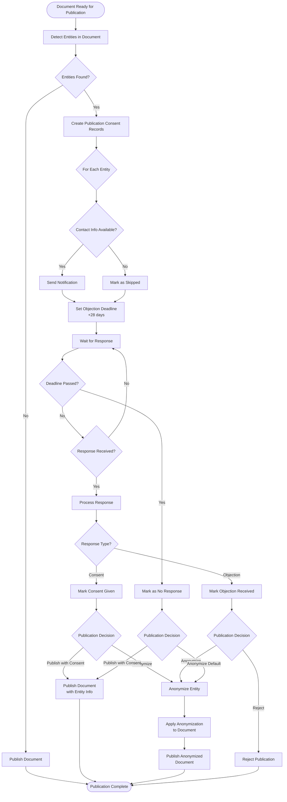

# Publication Consent Process

## Overview

The Publication Consent Process is a GDPR and Dutch Wet Open Overheid (Open Government Act) compliant workflow for managing the publication of documents containing personal data. This process ensures that organizations and persons mentioned in documents are properly informed and have the opportunity to object before publication.

## Legal Framework

### GDPR Requirements

Under the General Data Protection Regulation (GDPR), personal data can only be processed (including publication) if there is a legal basis. For public sector organizations, relevant legal bases include:

- **Article 6(1)(e)**: Processing is necessary for the performance of a task carried out in the public interest
- **Article 6(1)(f)**: Processing is necessary for the purposes of legitimate interests

### Dutch Wet Open Overheid

The Dutch Wet Open Overheid (Open Government Act) requires:

- **Article 3.1**: Government information should be proactively published
- **Article 3.2**: Personal data must be protected unless there is a legal basis for publication
- **Article 3.3**: Affected parties must be informed before publication
- **Minimum objection period**: 4 weeks (28 days) for parties to respond

## Process Flow

The following diagram illustrates the complete publication consent workflow:



## Detailed Process Steps

### Step 1: Entity Detection

When a document is prepared for publication:

1. **Text Extraction**: OpenRegister extracts text from the document (if not already done)
2. **Entity Detection**: DocuDesk uses Presidio to detect entities:
   - **PERSON**: Names of individuals
   - **ORGANIZATION**: Names of organizations
   - Other PII types (EMAIL_ADDRESS, PHONE_NUMBER, etc.) may also trigger the process
3. **Entity Filtering**: Only PERSON and ORGANIZATION entities trigger the consent process

### Step 2: Create Publication Consent Records

For each detected PERSON or ORGANIZATION entity:

1. **Create Record**: A new `publicationConsent` object is created in OpenRegister
2. **Store Entity Information**:
   - `entityType`: PERSON or ORGANIZATION
   - `entityText`: The detected text
   - `entityKey`: Unique identifier for anonymization
   - `documentId`: Reference to the document
3. **Initialize Status**:
   - `notificationStatus`: Set to "pending"
   - `consentStatus`: Set to "pending"
   - `publicationDecision`: Set to "pending"

### Step 3: Contact Information Lookup

For each entity, attempt to find contact information:

1. **Check Existing Records**: Look for existing contact information in:
   - OpenRegister entity records
   - Organization databases
   - Contact management systems
2. **Store Contact Info**:
   - `contactEmail`: Email address (if found)
   - `contactAddress`: Postal address (if found)
3. **Update Status**: If no contact info found, `notificationStatus` is set to "skipped"

### Step 4: Notification

Entities must be notified about pending publication:

1. **Notification Methods**:
   - **Email**: If `contactEmail` is available
   - **Postal Mail**: If only `contactAddress` is available
   - **Skipped**: If no contact information is available
2. **Notification Content**:
   - Document title and description
   - Where the entity is mentioned
   - Publication date
   - Objection deadline (minimum 4 weeks)
   - How to object
   - Legal basis for publication
3. **Update Status**:
   - `notificationStatus`: Set to "sent" or "delivered"
   - `notificationSentAt`: Record timestamp

### Step 5: Set Objection Deadline

According to Wet Open Overheid, entities must have at least 4 weeks to respond:

1. **Calculate Deadline**: 
   - `objectionDeadline` = `notificationSentAt` + 28 days (minimum)
   - Can be extended based on organizational policy
2. **Configuration**: The deadline period can be configured via:
   - `publication_objection_period_days` setting (default: 28 days)

### Step 6: Wait for Response

During the objection period:

1. **Monitor Responses**: Check for:
   - Consent given (via email, portal, or other method)
   - Objection received (via email, portal, or other method)
2. **Update Status**: As responses are received:
   - `consentStatus`: Updated to "consent_given" or "objection_received"
   - `objectionReceivedAt`: Timestamp (if objection)
   - `objectionReason`: Reason for objection (if provided)

### Step 7: Process Responses

After the deadline or when responses are received:

#### 7a. Consent Given

If an entity gives consent:

1. **Update Status**: `consentStatus` = "consent_given"
2. **Decision Options**:
   - **Publish with Consent**: Document can be published with entity information visible
   - **Anonymize Anyway**: Organization may still choose to anonymize for other reasons

#### 7b. Objection Received

If an entity objects:

1. **Update Status**: 
   - `consentStatus` = "objection_received"
   - `objectionReceivedAt` = current timestamp
   - `objectionReason` = reason provided
2. **Decision Options**:
   - **Anonymize**: Remove entity information before publication (recommended)
   - **Reject Publication**: Do not publish the document
   - **Override**: Only if there is a strong legal basis (rare)

#### 7c. No Response

If no response is received by the deadline:

1. **Update Status**: `consentStatus` = "no_response"
2. **Decision Options**:
   - **Anonymize (Default)**: Default to anonymization for privacy protection
   - **Publish with Consent**: Only if there is a clear legal basis

### Step 8: Make Publication Decision

For each entity, a final decision is made:

1. **Decision Types**:
   - `anonymize`: Remove entity information before publication
   - `publish_with_consent`: Publish with entity information visible
   - `publish_anonymized`: Publish anonymized version
   - `reject`: Do not publish the document
2. **Update Record**: `publicationDecision` is set to the chosen option
3. **Legal Basis**: `legalBasis` field documents the legal justification

### Step 9: Apply Anonymization (if needed)

If the decision is to anonymize:

1. **Retrieve Entities**: Get all entities marked for anonymization
2. **Apply Anonymization**: Use OpenRegister DocumentService to replace entity text
3. **Create Anonymized Version**: New file is created with `_anonymized` suffix
4. **Update Document**: Document metadata is updated with anonymization results

### Step 10: Publish Document

Final publication step:

1. **Check All Consents**: Ensure all publication consent records are resolved
2. **Publication Status**: Update document `publicationStatus`:
   - `published`: Document is published
   - `anonymized`: Anonymized version is published
   - `rejected`: Publication is rejected
3. **Audit Trail**: All decisions and timestamps are recorded for compliance

## Publication Consent Schema Fields

### Required Fields

- `documentId`: Reference to the document being published
- `entityType`: PERSON or ORGANIZATION
- `entityText`: The detected entity text

### Status Fields

- `notificationStatus`: pending, sent, delivered, failed, skipped
- `consentStatus`: pending, consent_given, objection_received, no_response, anonymized
- `publicationDecision`: pending, anonymize, publish_with_consent, publish_anonymized, reject

### Timeline Fields

- `notificationSentAt`: When notification was sent
- `objectionDeadline`: Deadline for objection (minimum 28 days)
- `objectionReceivedAt`: When objection was received (if applicable)

### Contact Fields

- `contactEmail`: Email address for notification
- `contactAddress`: Postal address for notification

### Decision Fields

- `objectionReason`: Reason for objection (if provided)
- `legalBasis`: Legal basis for publication decision
- `notes`: Internal notes about the process

## Configuration

### Application Settings

Configure the publication consent process via DocuDesk settings:

- `publication_objection_period_days`: Number of days for objection period (default: 28, minimum: 28)
- `publication_notification_email_template`: Email template for notifications
- `publication_notification_postal_template`: Postal mail template for notifications
- `publication_default_decision`: Default decision when no response (default: "anonymize")
- `publication_legal_basis_default`: Default legal basis for publication

### Register Configuration

The `publicationConsent` schema is configured in `docudesk_register.json`:

- Register: `document`
- Schema: `publicationConsent`
- Required fields: `documentId`, `entityType`, `entityText`

## API Endpoints

### Create Publication Consent Records

```http
POST /apps/docudesk/api/publication-consent/create
Content-Type: application/json

{
  "documentId": "uuid-of-document",
  "entities": [
    {
      "entityType": "PERSON",
      "entityText": "John Doe",
      "entityKey": "abc123"
    }
  ]
}
```

### Update Consent Status

```http
PUT /apps/docudesk/api/publication-consent/{id}
Content-Type: application/json

{
  "consentStatus": "consent_given",
  "objectionReason": null
}
```

### Get Consent Records for Document

```http
GET /apps/docudesk/api/publication-consent/document/{documentId}
```

### Make Publication Decision

```http
POST /apps/docudesk/api/publication-consent/{id}/decision
Content-Type: application/json

{
  "publicationDecision": "anonymize",
  "legalBasis": "Wet Open Overheid art. 3.1",
  "notes": "Entity objected, anonymizing before publication"
}
```

## Best Practices

### 1. Early Detection

- Detect entities as soon as documents are uploaded
- Create consent records immediately
- Start notification process early

### 2. Clear Communication

- Provide clear information about:
  - What document is being published
  - Where the entity is mentioned
  - Why publication is necessary
  - How to object

### 3. Adequate Time

- Always provide at least 4 weeks for response
- Consider extending for complex cases
- Document any deadline extensions

### 4. Document Decisions

- Always document the legal basis
- Record reasons for decisions
- Maintain audit trail

### 5. Default to Privacy

- When in doubt, anonymize
- Only publish with consent when legally justified
- Respect objections unless legally overridden

## Compliance Checklist

Before publishing a document, ensure:

- [ ] All entities (PERSON/ORGANIZATION) have been detected
- [ ] Publication consent records have been created
- [ ] All entities have been notified (or marked as skipped with reason)
- [ ] Objection deadline has been set (minimum 28 days)
- [ ] All responses have been processed
- [ ] Publication decisions have been made for all entities
- [ ] Legal basis has been documented
- [ ] Anonymization has been applied (if decision requires it)
- [ ] Audit trail is complete

## Example Scenarios

### Scenario 1: Consent Given

1. Document contains "John Doe" (PERSON)
2. Notification sent to john.doe@example.com
3. John responds: "I consent to publication"
4. Decision: `publish_with_consent`
5. Document published with "John Doe" visible

### Scenario 2: Objection Received

1. Document contains "Acme Corporation" (ORGANIZATION)
2. Notification sent to legal@acme.com
3. Acme responds: "We object due to commercial sensitivity"
4. Decision: `anonymize`
5. Document published with "[ORGANIZATION: abc123]" instead of "Acme Corporation"

### Scenario 3: No Response

1. Document contains "Jane Smith" (PERSON)
2. Notification sent to jane.smith@example.com
3. No response received within 28 days
4. Decision: `anonymize` (default)
5. Document published with "[PERSON: xyz789]" instead of "Jane Smith"

### Scenario 4: No Contact Information

1. Document contains "Unknown Organization" (ORGANIZATION)
2. No contact information available
3. Notification status: `skipped`
4. Decision: `anonymize` (default for skipped)
5. Document published with anonymized entity

## Entity-Level Policy Layer

Beyond the per-document workflow, DocuDesk supports two **entity-level** policy surfaces that pre-empt the workflow at detection time:

### Publication Prohibitions (`publicationProhibition` schema)

Deny-list rules. A matched entity is **always anonymised**, regardless of any per-document workflow or standing consent. Use cases:

- Court order to anonymise a witness ("witness A in case 2024/01")
- Statutory minor protection
- Undercover officers
- Categorical AVG exemptions decided by the Autoriteit Persoonsgegevens

A prohibition stores a real-world identity (preferably a stable identifier — BSN/KvK) plus a `reason`, `legalAuthority`, `severity`, `validFrom`/`validUntil`, and `active` flag.

### Standing Publication Consents (`publicationConsent` with `scope: "entity"`)

Allow-list rules. A matched entity may be published **without** running the 28-day objection workflow, because explicit consent was already obtained out-of-band. Use cases:

- Mayor signs a blanket consent for municipal decisions
- Organisation files an opt-in form for press releases
- Council member's standing consent for committee minutes

A standing consent stores a `consentMethod` (paper / digital_signature / verbal_recorded / opt_in_form), an optional `consentDocument` reference (audit-trail file), `consentScope` (textual scope description), and `validFrom`/`validUntil`/`active`.

### Three-layer evaluation order

For every detected entity in a publication-clearance flow, the consent service evaluates rules in this order:

1. **Publication prohibitions** — deny-list. If matched: `consentStatus: "anonymized"`, `notificationStatus: "skipped"`, `publicationDecision: "anonymize"`, `policyMatch` references the rule. Workflow ends.
2. **Standing publication consents** — allow-list. If matched (and no prohibition matches): `consentStatus: "consent_given"`, `notificationStatus: "skipped"`, `publicationDecision: "publish_with_consent"`, `policyMatch` references the rule. Workflow ends.
3. **Existing WOO workflow** — only reached when neither policy surface matches. Notification is sent, 28-day deadline starts, decision drives publication.

**Conflict resolution is deterministic and non-configurable**: prohibition wins. Multi-prohibition match is broken by lowest UUID (lexicographic).

### UI toggle semantics (per-document publication-prep screen)

The per-entity anonymisation toggle is keyed off the **referent type** of `policyMatch`, not the `consentStatus` enum:

| `policyMatch` referent | Toggle default | Overridable? |
|---|---|---|
| `null` | per existing UX based on `consentStatus` | yes |
| `publicationProhibition` | **ON, locked** | no |
| `publicationConsent` (scope=entity) | **OFF, defaulted** | yes — flipping ON anonymises anyway |

Overriding a standing-consent match is captured as a `publicationDecision: "anonymize"` change while `consentStatus` stays `"consent_given"` and `policyMatch` is preserved. The override is audit-logged via OpenRegister's mapper-level history.

### Retroactive behaviour

| Trigger | Effect on in-flight `scope: "document"` records |
|---|---|
| New prohibition created / activated / matchRules widened / validUntil extended | All matching in-flight records (status in `{pending, consent_given, objection_received, no_response}`) are **force-resolved to anonymised**. `notificationSentAt` and `objectionReceivedAt` are preserved for audit; `objectionDeadline` is cleared. |
| New standing consent created / activated | **No retroactive effect**. Standing consent applies to future detections only — past decisions are respected (privacy default wins on retroactive sweep). |
| Rule deletion / deactivation / expiry | **No retroactive effect**. Past records keep their final state with `policyMatch` intact (the reference becomes dangling; OpenRegister's referential-integrity surface governs how this is exposed). |
| Already-published documents | **Never modified**. Audit reports MAY surface "documents containing now-prohibited entities" for human review; the system does not initiate automatic redaction or republication. |

### Three admin surfaces

The Vue UI surfaces these in three separate admin pages — they are **not** consolidated:

| Page | Filter | Purpose |
|---|---|---|
| **Consent Workflow** | `publicationConsent` where `scope: "document"` | Per-document workflow records (the existing surface), now with a "policy pre-empted" indicator on rows whose `policyMatch` is non-null. |
| **Standing Publication Consents** | `publicationConsent` where `scope: "entity"` | List, edit, expire, revoke standing consents. The create-form requires `consentMethod` and warns when `validUntil` is left blank. |
| **Publication Prohibitions** | all `publicationProhibition` records | CRUD for prohibitions. The create-form encourages stable identifiers (BSN/KvK) and warns when only name-based rules are present. |

### RBAC defaults

| Surface | Read | Write |
|---|---|---|
| `publicationProhibition` | Authenticated users (no restriction by default) | `docudesk-policy-admins` group |
| `publicationConsent` (scope=document) | Existing consent-officer role | Existing consent-officer role |
| `publicationConsent` (scope=entity, "standing consent") | Existing consent-officer role can read | Service-level gate: `docudesk-standing-consent-admins` group is required. A consent-officer without this membership can still write `scope: "document"` records, but writes to `scope: "entity"` return 403. |

Admin users implicitly belong to both groups (NC convention). Adjust group memberships via the OpenRegister authorization UI.

## Related Documentation

- [Architecture Overview](../architecture.md)
- [Anonymization Features](./gdpr-anonymization.md)
- [API Documentation](../api/)


